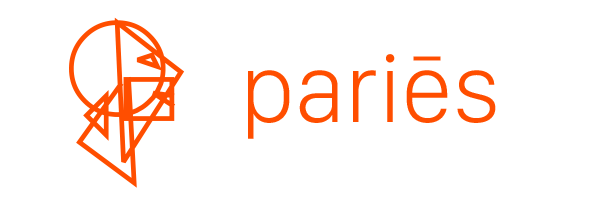

# 

[](https://travis-ci.com/jolle/paries)

```ts
import { paries, layer, rect } from 'paries';

const canvas = paries(
    {
        width: 100,
        height: 50
    },
    layer(
        rect({
            x: 10,
            y: 20,
            size: {
                width: 10,
                height: 10
            },
            fill: { fillColor: '#00ff00' }
        })
    ),
    rect({
        x: 50,
        y: 20,
        size: {
            dX: 65,
            dY: 24
        },
        stroke: { strokeColor: '#00ff00', strokeWidth: 3 }
    })
);

document.body.appendChild(canvas);
```
